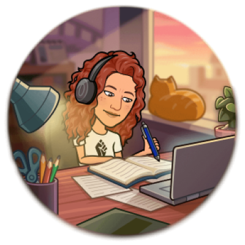

# Ejercicio de evaluación modulo 2 de Bea Figueroa

¡Hola 👋🏽! Este es mi ejercicio para superar el segundo modulo del bootcamp de programación en Adalab.

El ejercicio consiste en crear un página web, con diseño libre, aplicando los conocientos de JavaScript alcanzados durante este módulo:

- Modificar el DOM desde JS
- Usar condicionales
- Trabajar con listados de datos (arrays) y objetos literales
- Usar funciones para estructurar el código
- Escuchar al DOM y actuar en consecuencia
- Crear peticiones fetch y promesas
- Trabajar con la respuesta del servido
- Gestionar información en formato JSON
- Usar el LocalStorage para guardar información en el navegador

Para ello he usado las siguientes herramientas 🛠️:

- VISUAL STUDIO CODE 💻
- HTML 🖊️
- CSS 🖌️
- JS 👂
- GIT / GITHUB 🌳
- SASS / SCSS 🖼️
- GULP 🤖
- API 🔎
- LOCALSTORAGE 💾

Para crear este proyecto me han facilitado un Starter Kit de Adalab que incluye un motor de plantillas HTML, el preprocesador SASS, un servidor local y muchas cosas más.

La web consiste en un buscardor de cócteles. Si buscas el nombre de un cóctel se mostrará el listado de todos los cócteles que incluyan esa palabra y tendrás la opción de guardarlo en una lista de favoritos que podrás consultar en cualquier momento ya que esta se almacenará en la memoria de tu navegador, y cada vez que entre a esta web tendrás disponibles los cócteles guardados previamente. También tienes la opción de borrar cualquier elemento de tu lista de favoritos o incluso borrar el listado completo y volver a añadir los nuevos cócteles que hayas ido descubriendo.

En el ejercicio hay 3 tipos de ficheros y carpetas:

- Los 📋 ficheros que están sueltos en la raíz del repositorio, como gulpfile.js, package.json... Son para la configuración del proyecto.
- La 🗂️ carpeta `src/`: son los ficheros con lo que he estado trabajando (HTML, SCSS y las imágenes)
- La 📂 carpeta `docs/`, que es generada usando GULP. En ella se encuentra la versión de producción, que es la que voy a mostrar al mundo 🌍.

Espero que te haya gustado mi trabajo, si es así, ya sabes, ponme buena nota 💯😉
